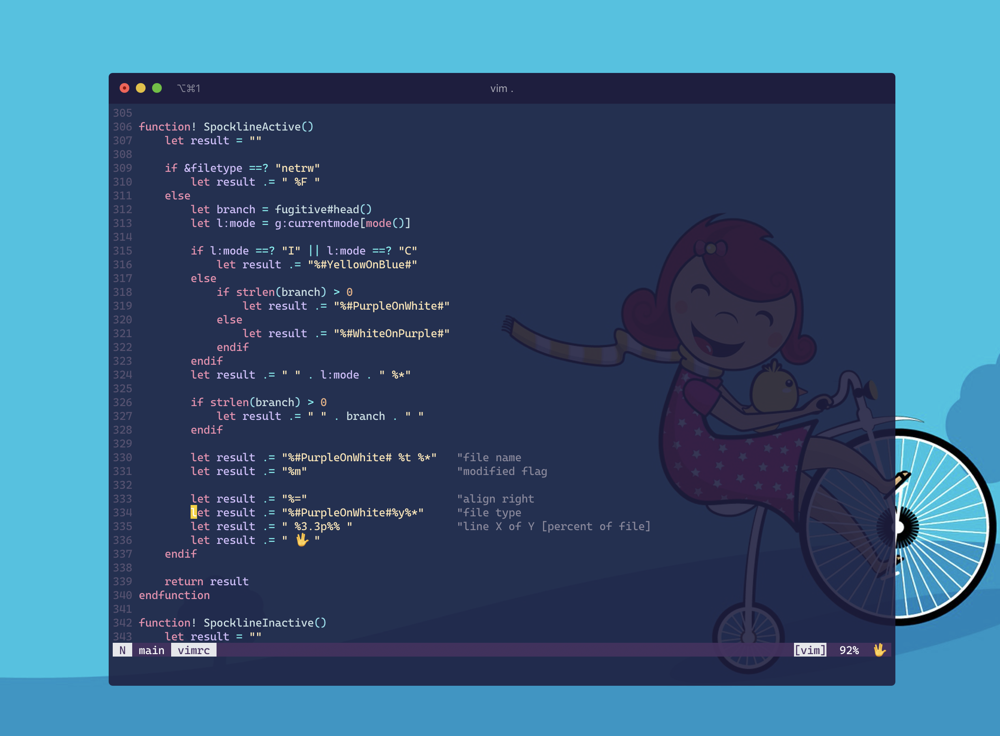

# dotfiles 🛠



## Overview
1. Installs Brew
2. Fixes "Home" and "End" buttons for macOS
3. Installs and configures Vim, Neovim, iTerm2 and git
4. `fn + i` for iTerm2 and `fn + t` for Telegram

## Set System Preferences
### Mission Control
1. Uncheck `Automatically rearrange Spaces based on most recent use`
2. Disable Hot Corners
3. Unset `Show Desktop` shortcut for F11 to work with VSCode

### Keyboard
1. Remap CapsLock to Escape `System Preferences -> Keyboard -> Modifier Keys`
2. Set `Input Sources` to `Kazakh` and `ABC - Extended`
3. In `Keyboard -> Text` turn off `Use smart quotes and dashes` and set the values to normal out of superstition

### Monitor
1. Turn OFF `Font smoothing` in `System Preferences -> General`
2. For Big Sur+:
```shell
defaults -currentHost write -g AppleFontSmoothing -int 0
```
3. In `System Preferences -> Display` set `Resolution: Scaled` and select the middle choice

[Source](https://tonsky.me/blog/monitors/)

## Fonts
1. [Hermit](https://github.com/pcaro90/hermit)
2. [Cascadia Code](https://github.com/microsoft/cascadia-code)
3. [Martian Mono](https://github.com/evilmartians/mono)

## iTerm
1. Go to `General -> Preferences -> Load Preferences from a custom folder`
2. Point to `dotfiles/iTerm`
3. In `Profiles -> Terminal` turn on `Unlimited Scrollback`

## Brew

1. Use `brew bundle dump` to create a dumpfile with all of the currently installed brew packages (add `--force` if the file exists)
2. Use `brew bundle` to install all of the packages in the `Brewfile`
3. [Tips & Tricks](https://gist.github.com/ChristopherA/a579274536aab36ea9966f301ff14f3f)

## Further considerations
1. Maybe use a tiling window manager like [Amethyst](https://ianyh.com/amethyst/) or [Yabai](https://github.com/koekeishiya/yabai)?


## Vim
### How to update Vim?
```shell
git clone https://github.com/vim/vim.git
cd vim/src
make
sudo make install
# Create a symbolic link for `vi`
sudo ln -s /usr/local/bin/vim /usr/local/bin/vi
```

### Vim Tricks
- Ignore sudo protection while saving
```vim
:w !sudo tee %
```

- Output external command's result in Vim
```vim
:.! date
```

- Command history
```vim
q:
```

- Open a URL (note the slash at the end)
```shell
vim https://stackoverflow.com/
```

### Profiling
```vim
:profile start profile.log
:profile func *
:profile file *
" At this point do slow actions
:profile pause
:noautocmd qall!

[Source](https://stackoverflow.com/a/12216578)
